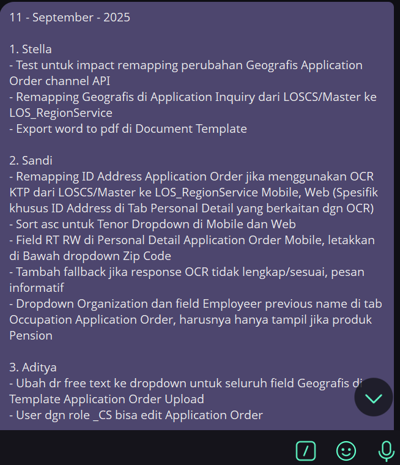
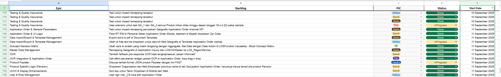

# Telegram Backlog Bot

Otomatisasi Proses Grooming Backlog Harian dari Telegram ke Google Sheets Menggunakan AI.

Bot ini dirancang untuk mengubah laporan harian yang dikirim melalui grup Telegram menjadi baris data yang terstruktur rapi di dalam Google Sheets. Proses ini didukung oleh AI (Google Gemini) untuk mengkategorikan setiap tugas ke dalam Epic yang relevan secara otomatis, serta mengelola status tugas dari waktu ke waktu.

---

## Daftar Isi
- [Preview](#preview)
- [Gambaran Umum](#gambaran-umum)
- [Fitur Utama](#fitur-utama)
- [Arsitektur Sistem](#arsitektur-sistem)
- [Prasyarat](#prasyarat)
- [Langkah-langkah Instalasi](#langkah-langkah-instalasi)
- [Cara Menjalankan (Development)](#cara-menjalankan-development)
- [Deployment (Production)](#deployment-production)
- [Struktur Proyek](#struktur-proyek)

---

## Preview

### 1. Input di Grup Telegram
Cukup kirim laporan harian dalam format teks sederhana dan mention bot di akhir.



### 2. Hasil Otomatis di Google Sheets
Bot akan memproses, mengkategorikan, mengupdate status, dan mensortir seluruh spreadsheet secara otomatis.



---

## Gambaran Umum

Setiap hari, laporan tugas dikirim ke grup Telegram. Proses manual untuk menyalin, memformat, mengkategorikan, dan mengupdate status di Google Sheets memakan waktu dan rentan terhadap kesalahan.

Bot ini mengotomatiskan seluruh alur kerja tersebut:
1.  **Mendengarkan**: Bot akan aktif ketika di-mention oleh admin di dalam grup Telegram.
2.  **Membaca & Membandingkan**: Bot membaca seluruh data "InProgress" yang ada di Google Sheets.
3.  **Memproses**: Pesan teks mentah dari Telegram diproses oleh **Task Converter** menjadi data terstruktur.
4.  **Menganalisis**: Setiap tugas baru dikirim ke **Backlog Converter** yang menggunakan Google Gemini untuk menetapkan **Epic** yang konsisten, berdasarkan daftar Epic yang sudah ada.
5.  **Update Status & Simpan**: Bot membandingkan laporan baru dengan data lama. Task yang tidak lagi dilaporkan akan diubah statusnya menjadi "Done". Task baru akan ditambahkan.
6.  **Mengorganisir**: Seluruh isi worksheet akan ditulis ulang dan disortir secara otomatis berdasarkan tanggal dan Epic.
7.  **Memberi Feedback**: Bot akan mengirim notifikasi pribadi ke admin untuk mengonfirmasi bahwa proses telah berhasil.

## Fitur Utama

-   ✅ **Otomatisasi Penuh**: Mengubah laporan harian menjadi spreadsheet yang terorganisir tanpa intervensi manual.
-   ✅ **Manajemen Status Otomatis**: Secara cerdas mendeteksi task yang tidak lagi dilaporkan dan mengubah statusnya dari `InProgress` menjadi `Done` serta mengisi `End Date`.
-   ✅ **Kategorisasi Cerdas dengan AI**: Menggunakan Google Gemini untuk menetapkan Epic secara dinamis, dengan memprioritaskan Epic yang sudah ada untuk menjaga konsistensi.
-   ✅ **Pengorganisasian Otomatis**: Menambahkan data baru dan secara otomatis mensortir seluruh spreadsheet berdasarkan tanggal dan Epic, menjaga data tetap rapi.
-   ✅ **Keamanan**: Hanya merespons mention dari ID Telegram admin yang sudah ditentukan di konfigurasi.
-   ✅ **Manajemen Kuota**: Mendukung rotasi beberapa API key Gemini untuk menghindari batas kuota dan mendistribusikan beban.
-   ✅ **Andal**: Dibangun untuk berjalan 24/7 di server menggunakan PM2 dan Nginx.

## Arsitektur Sistem

-   **Antarmuka**: Bot Telegram
-   **Backend Server**: Aplikasi Flask (Python) yang berjalan sebagai webhook.
-   **Process Manager**: PM2
-   **Reverse Proxy**: Nginx
-   **Processing Core**:
    -   `Task Converter`: Modul Python untuk parsing awal teks Telegram.
    -   `Backlog Converter`: Modul Python yang terintegrasi dengan Google Gemini untuk kategorisasi Epic.
-   **Penyimpanan Data**: Google Sheets
-   **Konektor**:
    -   `python-telegram-bot` untuk komunikasi dengan Telegram API.
    -   `gspread` untuk komunikasi dengan Google Sheets API.

## Prasyarat

Sebelum memulai, pastikan Anda memiliki:
-   Server VPS (misalnya, AlmaLinux) dengan akses root/sudo.
-   Python 3.11 atau lebih tinggi.
-   Node.js dan npm (untuk menginstal PM2).
-   Akun Telegram.
-   Akun Google Cloud dengan penagihan (billing) aktif.
-   [Ngrok](https://ngrok.com/download) (opsional, untuk development lokal).

## Langkah-langkah Instalasi

1.  **Clone Repository**
    ```bash
    git clone <URL_REPOSITORY_ANDA>
    cd telegram_backlog_bot
    ```

2.  **Install Python 3.11 & Node.js (jika belum ada di server)**
    ```bash
    # Untuk AlmaLinux
    sudo dnf install python3.11 python3.11-pip -y
    sudo dnf install nodejs -y 
    ```

3.  **Install PM2**
    ```bash
    npm install pm2 -g
    pm2 startup 
    # Jalankan perintah yang diberikan oleh pm2 startup
    ```

4.  **Buat Virtual Environment**
    ```bash
    python3.11 -m venv venv
    source venv/bin/activate
    ```

5.  **Install Dependencies**
    ```bash
    pip install -r requirements.txt
    ```

6.  **Setup Kredensial**
    Ikuti langkah-langkah di `README` sebelumnya untuk mendapatkan semua token dan file kredensial.

7.  **Konfigurasi File `.env`**
    -   Buat salinan dari `.env.example` dan beri nama `.env`.
    -   Buka file `.env` dan isi semua nilainya.

## Cara Menjalankan (Development)

Untuk testing di mesin lokal Anda.

1.  **Jalankan Ngrok**
    ```bash
    ngrok http 5001
    ```
    Salin URL `https` yang diberikan.

2.  **Update `.env`**
    -   Tempelkan URL Ngrok ke variabel `WEBHOOK_URL`.

3.  **Jalankan Server Flask**
    ```bash
    # Pastikan venv aktif
    python app.py
    ```

## Deployment (Production)

Untuk menjalankan bot 24/7 di server VPS Anda.

1.  **Buat File Konfigurasi PM2**
    Buat file `ecosystem.config.js` di root proyek Anda.
    ```javascript
    module.exports = {
      apps : [{
        name   : "backlog-bot",
        script : "app.py",
        interpreter: "/path/to/your/project/venv/bin/python3.11", // Gunakan path absolut
      }]
    }
    ```

2.  **Mulai Aplikasi dengan PM2**
    ```bash
    pm2 start ecosystem.config.js
    pm2 save
    ```

3.  **Konfigurasi Nginx**
    -   Buat file konfigurasi di `/etc/nginx/conf.d/backlogbot.conf`.
    -   Isi dengan konfigurasi reverse proxy yang mengarah ke `http://127.0.0.1:5001`.
    -   Restart Nginx: `sudo systemctl restart nginx`.

4.  **Gunakan Bot di Telegram**
    -   Undang bot ke grup.
    -   Kirim laporan harian dan mention bot di akhir.

## Struktur Proyek

```
telegram_backlog_bot/
├── app.py                  # Server utama Flask, menangani webhook dan alur kerja.
├── telegram_bot.py         # Kelas untuk berinteraksi dengan Telegram API.
├── google_sheets.py        # Kelas untuk membaca/menulis data ke Google Sheets.
├── converters/             # Modul untuk logika pemrosesan teks.
│   ├── __init__.py
│   ├── task_converter.py   # Mengubah teks mentah Telegram menjadi data terstruktur awal.
│   └── backlog_converter.py# Menggunakan LLM untuk menambahkan Epic ke data.
├── screenshot/             # Folder berisi gambar preview.
│   ├── backlog.png
│   └── task_telegram.png
├── ecosystem.config.js     # File konfigurasi untuk PM2.
├── credentials.json        # Kredensial Service Account Google (diabaikan oleh .gitignore).
├── requirements.txt        # Daftar library Python yang dibutuhkan.
├── .env                    # File konfigurasi untuk semua kredensial (diabaikan oleh .gitignore).
└── .env.example            # Template untuk file .env.
```
````